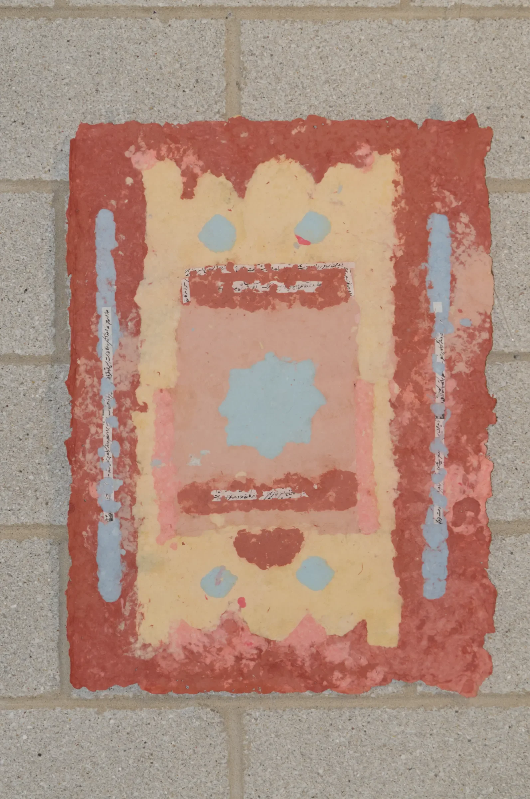
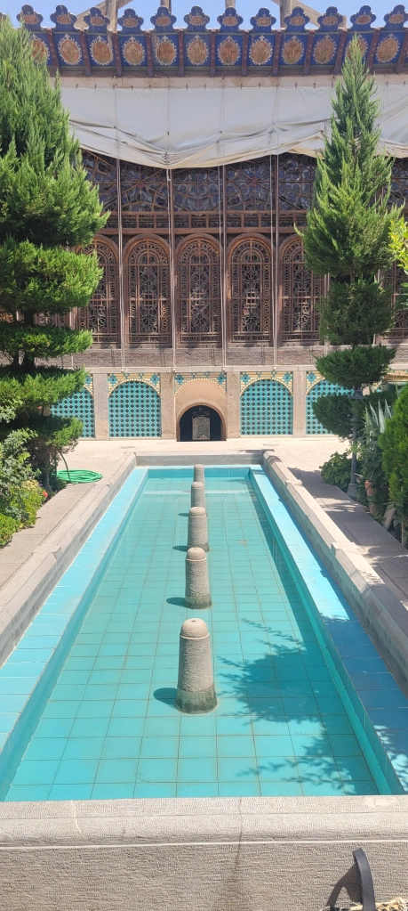
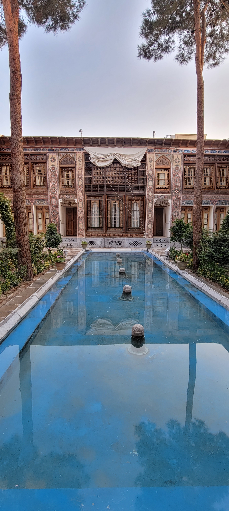
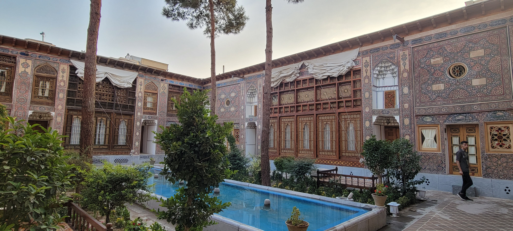
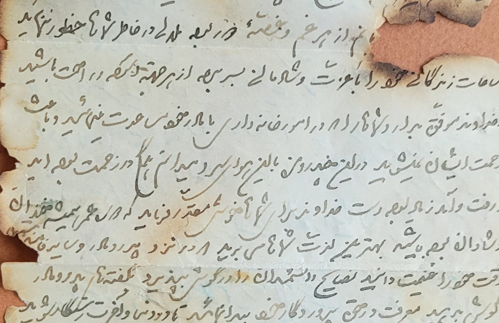

# Exhibition Review at Massy Art Gallery[^1]

**Rafael Zen** – Your show investigates a sense of space through the exploration of architectonic and linguistic structures. Taking this into consideration, why the title “Inter/me/diary”? What do you think it reveals about what the viewers can expect from this exhibition?

**Yasaman Moussavi** – Architecture and language have always fascinated me. Basically, the former is spatial order, and the latter is mental organization. In the broader sense, architecture can be seen as a form of non-verbal communication, just as language can be seen as an expression of verbal communication.

Yet, the two have a deeper connection. We live through language but experience within a space. As an expression of a form of life, architecture embodies the spatial experience of language. Understanding the correlation between the sensory experience and the structure in our embodied experience of a place is of particular interest to me. 

Through these works, I interrogated the ways in which the domestic spaces were organized around social activities and communal identities. In addition, they hold a lot of personal significance for me. They render my imagination when reading through my great grandfather’s letters and diary about everyday life. A teacher and acute observer, he narrated his sometimes funny daily life in Isfahan, a historical city in central Iran, in letters to his children and friends.

I choose this title, “Inter/me/diary,” because these works are autobiographical or visual diaries, I guess, for the lack of a better term. They are relational as well. Throughout this project, I was engaged with the concept of intermediate states, which I conceive as relational spaces produced by continuous interactions. The idea of tracing them was intriguing to me, like keeping a diary of fleeting experiences.

**RZ** – Why an investigation on the traditional central courtyard of Persian domestic architecture? What do you think this place represents as a metaphor in this show, but also in your personal history/memory?

**YM** – Islamic architecture is often well-known for its monumental structures, such as the Taj Mahal or the Grand Mosque of Isfahan. As fascinating as they are, I was also drawn to the less appreciated vernacular architecture and the built environments.

These living spaces are integral parts of everyday life as well as the cultural identity of its inhabitants. The design of these structures is influenced by the availability of local materials, and the climate, among other social and environmental factors.

These factors vary widely across the country, which is why you might see different vernacular architecture from one region to another, as opposed to the streamlined monumental architecture like grand mosques.

In this series, I studied traditional houses in Isfahan with a special focus on the courtyard as a key element. The courtyard is a constitutive element in vernacular architecture, mostly in arid regions of Iran.

Often rectangular, it serves as the heart of the home and provides a nice green area for the family and friends to gather and spend time together. There are symbolically significant elements in a courtyard, such as the garden, the fountain, and so on.

As part of this project, nevertheless, I was curious to explore how courtyards function as spaces for social activities and mobility that enable a dialogue between the individual and collective embodiment, transcending the rigid structures of identity.

The plan of these houses is based on binaries of interior and exterior, public and private spaces, yet the courtyard is a transitory space that mediates between the two. There is a sense of communal existence in a courtyard because of the possibilities for more inclusive social interactions. In reconstructing the sense of dwelling in these spaces, I benefited from my own personal experience. 

I have visited many of the remaining sites in Isfahan to gain a firsthand understanding of these places. In addition, as a child, I was told stories about my great grandfather’s Isfahan house. I recall my grandfather and other family members who lived there talking about their memories and all the things that happened there during a gathering in his home. 

::div
{class=".w-[400px]"}
{class=".w-[400px]"}
{class=".w-[400px]"}
::

**RZ** – By combining both – fragments of family epistolary communications and diaries + the spatiality of courtyards, do you think your work addresses the relation between public and private worlds? What are words and inscriptions for, in these pieces? 

**YM** – I gathered the words and sentences for my work from a few letters my great grandfather wrote to his sons who lived in the capital city to attend a teacher training college. They are letters about family bonds filled with passion, joy, and homesickness.

One of the letters expresses his appreciation for his son’s perseverance and eagerness to be a teacher and how much he missed him. His son expressed his homesickness and loneliness poetically, explaining his mixed feelings about being away from home and away from his family. He begins his letter with a poetic sentence: به یاد وصل رخت صبحگاه برخیزم” I get up every morning hoping to see you!” 

Family letters

Some of the letters were written while he was traveling, and for me, those words and poetic sentences float and move from one place to another. Physically, they fell onto the page, but their meaning is fleeting, allowing us to interpret them freely.

I disassembled these letters and scattered the isolated words all over unexplored visual territories. However estranged these words may seem in the new context, they also bring their identity and meaning with them, leading to new relationships.

Compared to immigrants who leave their hometown without anticipating where they will settle, the words on the paper hold their hope for a better future. There is an intersection where the private dreams expressed in the letters and the public space meet, interact, and even collide. Collaging and handmade pulp paintings, therefore, have been mediums to explore these intersections for me.

A family letter

**RZ** – Could you explain why paper interests you as an artist? And, in this particular exhibition, do you think using paper as media guided your artistic experience? If so, how?

**YM** – I have been inspired by paper, a material that hosts words and allows for the expression of sentiments. Rather than serving as a bare surface for inscription, my work uses paper as a pre-textual structure (construct) to translate ephemeral senses into physical impressions.

For me, the stages in making a sheet of paper is similar to various stages and processes in life. Each transitional step is filled with unexpected events, wonder, joy, and tension. It is an exploration of new things, new ideas.

The process involves in papermaking, such as soaking, beating, screening, and finally, forming fibers to dry, is an educative process that unfolds many potentials. I am interested in exploring how materials interact, move, and shifts within space and time. This dialectical dialogue between materials conceptualizes making as a relational activity deeply connected to our lives.

[^1]: An Interview with the artist Yasaman Moussavi, conducted by Rafael Zen and published on the Massy Art Gallery

