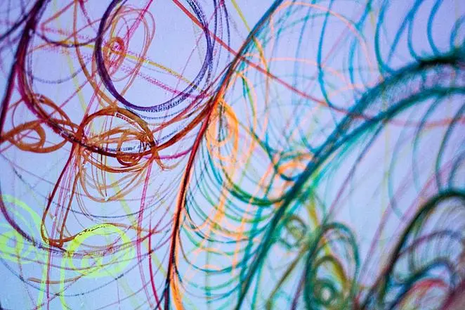

[^1]

Otherworldly, cosmic, surreal—it’s hard to find a word that fully captures the feeling of walking through Yasaman Moussavi’s thesis show “Shadow Facing the Light”.  A well planned occupancy limit allowed only a small group at a time, leaving an anticipating line of viewers to wait outside a white maze of swelling light. From inside, an eerie chime seems to call to the viewer, inviting them to enter. Before even experiencing the piece, we are faced with an enigma – what lies beyond the curtain, and what is at the end.

For the sake of cleanliness, each viewer is handed a pair of clean room booties, an attempt to keep the white Tyvek floor from being blemished: a practical but oddly clinical choice.  Upon walking through, the viewer teeters between bewilderment and curiosity. Soft prisms of light glow from the surrounding white walls fashioned from layers of white Tyvek, removing all indications of familiarity and throwing us into something alien. Delicate paintings begin to emerge from the shadows, from the surrounding white void, that suggest patterns, faces, and even calligraphy. Cartographic, or perhaps narrative of the viewer’s passage, the paintings become symbols of experience, of the visual, of self – all unified by this ambiguous space. Moussavi’s brilliant colors and stunning marks show sensitivity not only to her rich Iranian heritage, but also the sensation of figure and form.

As you slip into the depths of Moussavi’s world, the white space becomes shrouded, a shadow falls upon the walls, obscuring what was once clear. The pulsating lights of color become stronger as if one is nearing the heart of a space ship or a sci-fi experiment. Surface, line, paint, even the viewer become subject to the darkness, what Moussavi says will happen “when the veil is lifted; the shadow will show itself.” But this is darkness momentary, a small but significant part of the artist’s constructed journey. Upon reaching the final room, one reaches the end of the path, but what we see instead is not an end, but a joining of light and dark, . The shrouded lights become clear, illuminating a set of ceiling tethered pieces of reflective plexi-glass. Perhaps most striking is the circular surface behind them, housing a projected video of the artist’s face, which is overlaid with color and pattern – fusing several spatial elements into one. The artists face is a reminder of presence, the significance of being within the space, of reaching and of understanding. A poignant and sophisticated synthesis, these pieces function as a culmination of journey, the moment Moussavi says, “when two become one.”  In front of this central mobile, lies a drawing on the wall and a drawing on the floor, radiating with amniotic, womb-like shapes. The bodily presence is inescapable, seamlessly woven into the white vastness.

Moussavi’s installation gives us everything we would not expect from a painter, devoid of texture, familiar surfaces, or noticeable brushwork. Instead, the artist immerses us into an unknown place. A dynamic of seeing and becoming, becomes a temporal, and perceptual experience for the viewer. In this “journey between spaces”, there is never a complete conclusion of what the space actually is. Instead, we must realize the movement of light and shadow, showing us that each entity must exist to understand the other.

[^1]: Article by Ashley Busby, photos by Kristin Swartz. The original article accessible [here](http://www.thebowerbirdlbk.com/#!Yasaman-Moussavi-Shadow-Facing-the-Light/c16ee/5558f4c70cf298b2d3c41675)